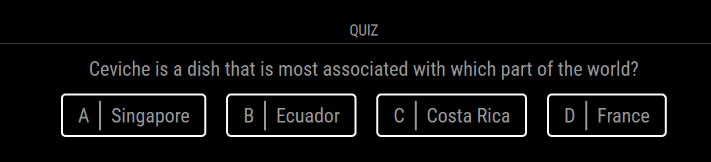
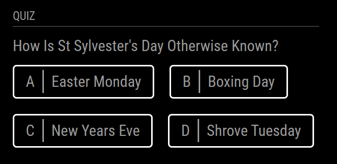

# MMM-Quiz




This [MagicMirror²][mm] Module is designed to let you play a quiz. Answering the questions can be done by clicking on the elements or interacting through the notifications.

## Installation

In your terminal, go to your MagicMirror's Module folder:

```bash
cd ~/MagicMirror/modules
```
Clone this repository:
```bash
git clone https://github.com/Dennis-Rosenbaum/MMM-Quiz.git
```
Configure the module in your config.js file.

## Using the module

To use this module, add it to the modules array in the `config/config.js` file:
```js
modules: [
    {
        module: 'MMM-Quiz',
        position: 'lower_third',
        config: {
        }
    }
]
```

Or you could use all the options:
```js
modules: [
    {
        module: 'MMM-Quiz',
        position: 'lower_third',
        config: {
            maxWidth: '300px',
            align: 'center',
            difficulties: 'easy,medium',
            tags: 'sport_and_leisure,history'
        }
    }
]
```

## Configuration options

Option|Possible values|Description
------|------|-----------
`maxWidth`|200px, 40%|Should the module have a maximum width
`align`|left, center, right|Should the content of the module be aligned
`difficulties`|easy, medium, hard|Comma separated list of difficulties of questions to return. If not provided, all difficulties will be used. Example: 'easy', 'easy,medium'
`tags`|music, sport_and_leisure, film_and_tv, arts_and_literature, history, society_and_culture, science, geography, food_and_drink, general_knowledge|Comma separated list of tags to return questions from. If not provided, all tags will be used. Example: 'science', 'science,music'

## DOM example
The dom will look like this:

```html
<div class="question">What is the question?</div>
<div class="answers">
  <div class="answer" data-id="0" data-is-correct-answer="false">
      <div class="answer-id">A</div>
      <div class="answer-text">The answer</div>
  </div>
  <div class="answer" data-id="1" data-is-correct-answer="false">
      <div class="answer-id">B</div>
      <div class="answer-text">The question</div>
  </div>
  <div class="answer" data-id="2" data-is-correct-answer="true">
      <div class="answer-id">C</div>
      <div class="answer-text">The multiple answer</div>
  </div>
  <div class="answer" data-id="3" data-is-correct-answer="false">
      <div class="answer-id">D</div>
      <div class="answer-text">Nobody knows</div>
  </div>
</div>
```

When the user inputs an answer, the class 'correct' or 'incorrect' will be added to the answer. 

## Sending notifications to the module

Notification|Description
------|-----------
`QUIZ_ANSWER`|Give an answer to the current question, the payload should contain the index value (0-3)<br/>**Expected Value type:** `{int}`

If you want to answer the third question, you would write:
```js
this.sendNotification("QUIZ_ANSWER", 2)
```


[mm]: https://github.com/MichMich/MagicMirror
